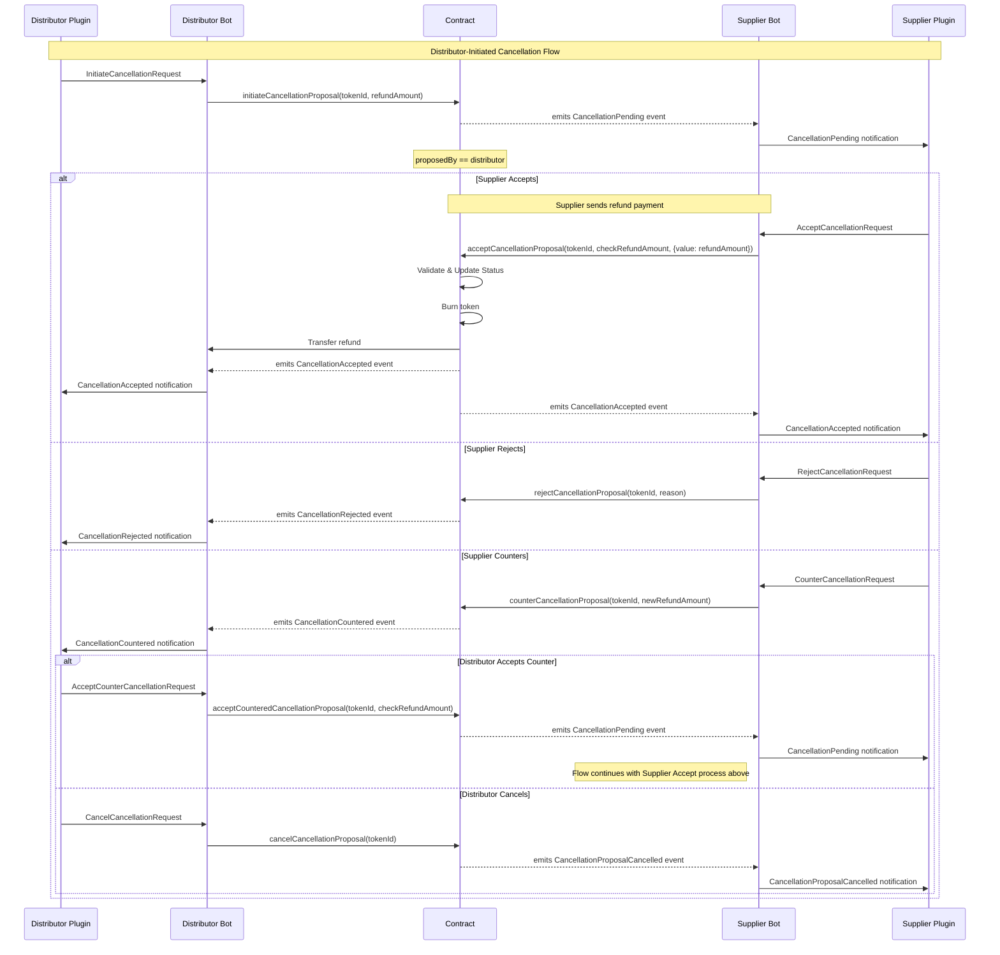
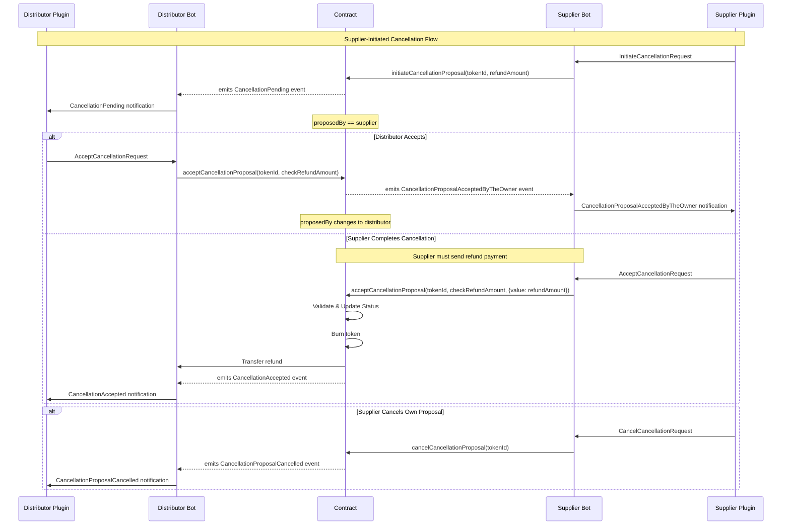

# Booking Token Cancellation Process

The Camino Messenger platform implements a flexible cancellation system for booking
tokens that accommodates both distributor-initiated and supplier-initiated
cancellations. The process is designed to allow negotiation between parties while
maintaining security and clarity throughout the cancellation flow.

The process consists of multiple steps, but the messages are small and the fields
used are frequently the same, which results to only small additional complexity
compared to a direct API call to check whether a booking is cancellable and what
the cancellation cost is, followed by a finalization call for the cancellation.

If the booking is paid off-chain and the cancellation is initiated, an ISO currency
is specified in the refund_amount and the on-chain refund transaction is skipped.

This way the process is uniform for on/off-chain payments and serves as a ledger
to avoid disputes.

>tbc: the cancellation does accept ISO currency in the message, but the contract cannot handle it

## Overview

The cancellation process can be initiated by either the distributor (token owner) or
the supplier, with different flows depending on who initiates the cancellation. Each
flow includes safety checks, refund handling, and clear state transitions managed
through smart contracts.

The process is designed to have the distributor and the supplier agree on the
cancellation cost during the process. Normally the cancellation conditions are fixed
during the initial booking process in rules. These rules can be interpreted
differently between distributor and supplier, which can lead to disputes.

When a distributor has stored the cancellation conditions with the booking, the
cancellation process can be started with the `InitiateCancellationRequest`.
In case the cancellation conditions are not stored or the distributor wants to check
the cancellation cost before initiating the process, the `CheckCancellationRequest`
can be used.

It is important to note that in all cases the refund amount must be specified and
not the cancellation cost. This is because the originally (to be) paid amount for
the initial booking (for example 1,000€) was already specified in a previous
transaction, for the cancellation transaction, the reverse payment needs to be
specified (assuming a cancellation cost of 200€, the refund amount will be 800€).

The initiation of the cancellation is stored on-chain, which eliminates disputes
regarding the moment of cancellation. If the service can be cancelled, the supplier
cancels the service in their inventory system and the bot initiates the transfer
of the refund amount and the booking token is burned.

The supplier can also reject the cancellation using `RejectCancellation` for example
when the service is already used or in case cancellation is not possible (for
example in case of a non-refundable rate plan).

In case the supplier does not agree to the proposed refund amount (cancellation cost)
a `CounterCancellation`can be proposed by the supplier and if agreeable for the
distributor, the cancellation can be finished with this new refund value by using
`AcceptCounterCancellation`.

## Cancellation Flows

### Distributor-Initiated Cancellation

When a distributor initiates a cancellation, the following options are available to
the supplier:

1. **Initiation**

   - The distributor sends `InitiateCancellationRequest` with TokenID and proposed Refund amount
   - The response is the transaction ID of the registration on the blockchain

2. **Direct Acceptance**

   - The supplier does a look-up from the TokenID in the `CancellationPending notification`
     to determine the inventory system booking reference to be cancelled.
   - The supplier can accept the cancellation by accepting the proposed refund amount and
     whether the booking can be cancelled.
   - Supplier partner plugin submits the `AcceptCancellationRequest` to the supplier bot
   - Supplier bot submits `CancellationAccepted` event, burns the booking token and initiates
     the refund transaction.
   - Distributor bot listens for on-chain events, receives the `CancellationAccepted notification`
     and forwards the notification to the distributor partner plugin, confirms the reception of
     the refund and burns the booking token.
   - Supplier bot listens for on-chain events, receives the `CancellationAccepted notification`
     and forwards the notification to the partner plugin. As the booking token is now burned,
     the booking can definitively be cancelled in the inventory system.

3. **Rejection**
It is not always possible to cancel a booking. It might be that the service is already used
or that the service has been partially used (for example the first couple of days of a ----------
stay or car rental)

   - Upon reception of the `CancellationPending notification`, the supplier checks whether the
     booking can be cancelled.
   - The supplier can reject the cancellation with a specific reason, using the `RejectCancellationRequest`
     A reason must be given why the cancellation is not possible
   - This terminates the cancellation process with a CancellationRejected notification

4. **Counter-Proposal**
In case the booking can be cancelled, but the refund amount provided by the distributor
does not match the original cost minus the cancellation cost, the supplier can return
a counter proposal with a corrected refund amount.

   - Upon reception of the `CancellationPending notification`, the supplier checks whether the
     booking can be cancelled and the proposed refund amount is correct.
   - The supplier can counter with a different refund amount using the `CounterCancellationRequest`
   - The distributor receives the `CancellationCountered notification` and can then either:
     - Accept the counter-proposal, using the `AcceptCounterCancellationRequest`.
     - Cancel the entire cancellation process using the `CancelCancellationRequest`.

The CancelCancellation request can only be emitted by the initiator of the cancellation,
which is the owner of the "Cancellation Proposal". For example if an employee has requested
the cancellation of the wrong booking. As soon as the cancellation is accepted the
CancelCancellation process will return an error. Once a CancelCancellation proposal is
completed, the cancellation proposal is deleted.

#### Sequence Diagram

>tbc: can the Distributor reject the supplier initiated cancellation? Or is it only possible to accept or not respond?
>tbc: *enforced cancellation* for some edge cases

### Supplier-Initiated Cancellation
Supplier can initiate cancellations for example in case an excursion cannot take
place due to weather conditions, etc. We will extend this section in the future
to include alternatives, so that instead of cancelling the excursion a modification
to tomorrow when the weather if fine can be offered.

When a supplier initiates a cancellation, the process differs slightly:

1. **Initial Proposal**

   - The supplier proposes a cancellation with a specific refund amount using
  SupplierPlugin ->> Supplier: InitiateCancellationRequest
     `InitiateCancellationRequest`.
   - The supplier can cancel their own proposal any time before distributor
     acceptance
   - The distributor receives the `CancellationPending notification`.

2. **Distributor Acceptance**
   - If the distributor accepts, the `AcceptCancellationRequest` is transmitted.
     The proposal ownership transfers to the distributor.
   - The supplier must then complete the cancellation by providing the refund
     in exactly the same manner as the distributor initiated process.
   - The distributor can still cancel after accepting but before the supplier
     completes the process
   - Theoretically it is possible that the distributor does not agree to the refund
     proposed by the supplier, but a "CounterProposal" flow is not available.

#### Sequence Diagram

## Security and Validation

- All refund amounts are validated at multiple steps
- Both parties must agree on the final refund amount
- The token state is managed securely throughout the process
- Events are emitted at each step to maintain transparency
- Smart contract state transitions prevent invalid operation sequences

## Refund Processing

- Refunds can be processed in native currency or ERC20 tokens
- The supplier must provide the exact refund amount agreed upon
- Refunds are automatically transferred to the distributor upon successful
  cancellation
- The token is burned only after successful refund transfer

This process ensures a fair, secure, and flexible system for handling booking
cancellations while maintaining the integrity of the booking token system.
