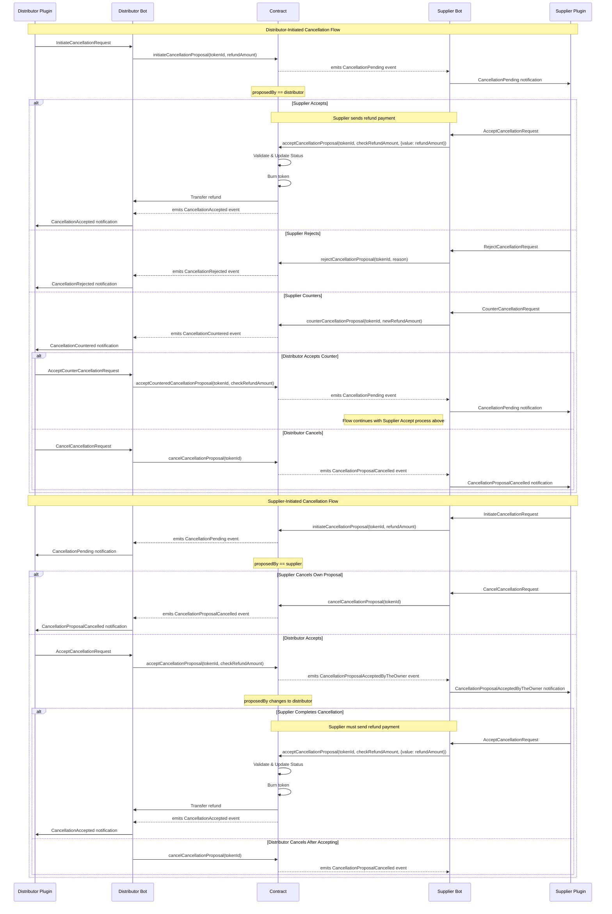
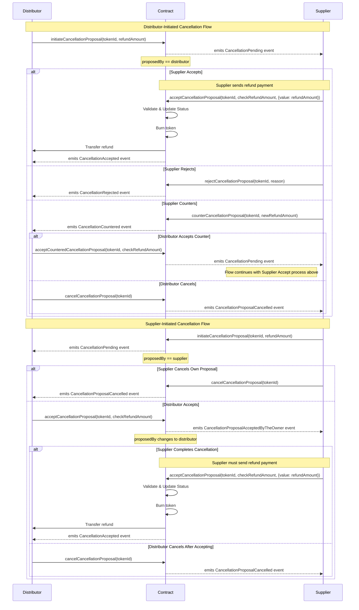

# Booking Token Cancellation Process

The Camino Messenger platform implements a flexible cancellation system for booking
tokens that accommodates both distributor-initiated and supplier-initiated
cancellations. The process is designed to allow negotiation between parties while
maintaining security and clarity throughout the cancellation flow.

## Overview

The cancellation process can be initiated by either the distributor (token owner) or
the supplier, with different flows depending on who initiates the cancellation. Each
flow includes safety checks, refund handling, and clear state transitions managed
through smart contracts.

The process is designed to have the distributor and the supplier agree on the
cancellation cost during the process. Normally the cancellation conditions are fixed
during the initial booking process in rules. These rules can be interpreted
differently between distributor and supplier, which can lead to disputes.

When a distributor has stored the cancellation conditions with the booking, the
cancellation process can be started with the `InitiateCancellationRequest`.
In case the cancellation conditions are not stored or the distributor wants to check
the cancellation cost before initiating the process, the `CheckCancellationRequest`
can be used.

It is important to note that in all cases the refund amount must be specified and
not the cancellation cost. This is because the originally (to be) paid amount for
the initial booking (for example 1,000€) was already specified in a previous
transaction, for the cancellation transaction, the reverse payment needs to be
specified (assuming a cancellation cost of 200€, the refund amount will be 800€).

The initiation of the cancellation is stored on-chain, which eliminates disputes
regarding the moment of cancellation. If the service can be cancelled, the supplier
cancels the service in their inventory system and the bot initiates the transfer
of the refund amount and the booking token is burned.

The supplier can also reject the cancellation using `RejectCancellation` for example
when the service is already used or in case cancellation is not possible (for
example in case of a non-refundable rateplan).

In case the supplier does not agree to the proposed refund amount (cancellation cost)
a `CounterCancellation`can be proposed by the supplier and if agreeable for the
distributor, the cancellation can be finished with this new refund value by using
`AcceptCounterCancellation`.

## Cancellation Flows

### Distributor-Initiated Cancellation

When a distributor initiates a cancellation, the following options are available to
the supplier:

1. **Initiation**

   - The distributor sends `InitiateCancellationRequest` with TokenID and proposed Refund amount
   - The response is the transaction ID of the registration on the blockchain

2. **Direct Acceptance**

   - The supplier does a look-up from the TokenID in the `InitiateCancellationRequest`
     to determine the inventory system booking reference to be cancelled
   - The supplier can accept the cancellation by accepting the proposed refund amount
   - Supplier partner plugin submits the `AcceptCancellationRequest` to the supplier bot
   - Supplier bot submits `CancellationAccepted` event and initiates the refund transaction
   - Distributor bot listens for on-chain events, submits the `AcceptCancellationRequest`
     to the partner plugin, confirms the reception of the refund and burns the booking token.

# This is old text
***

2. **Rejection**

   - The supplier can reject the cancellation with a specific reason
   - This terminates the cancellation process

3. **Counter-Proposal**
   - The supplier can counter with a different refund amount
   - The distributor can then either:
     - Accept the counter-proposal, leading to the supplier's acceptance flow
     - Cancel the entire cancellation process

### Supplier-Initiated Cancellation

When a supplier initiates a cancellation, the process differs slightly:

1. **Initial Proposal**

   - The supplier proposes a cancellation with a specific refund amount
   - The supplier can cancel their own proposal at any time before distributor
     acceptance

2. **Distributor Acceptance**
   - If the distributor accepts, the proposal ownership transfers to the distributor
   - The supplier must then complete the cancellation by providing the refund
   - The distributor can still cancel after accepting but before the supplier
     completes the process

## Security and Validation

- All refund amounts are validated at multiple steps
- Both parties must agree on the final refund amount
- The token state is managed securely throughout the process
- Events are emitted at each step to maintain transparency
- Smart contract state transitions prevent invalid operation sequences

## Refund Processing

- Refunds can be processed in native currency or ERC20 tokens
- The supplier must provide the exact refund amount agreed upon
- Refunds are automatically transferred to the distributor upon successful
  cancellation
- The token is burned only after successful refund transfer

This process ensures a fair, secure, and flexible system for handling booking
cancellations while maintaining the integrity of the booking token system.

## Sequence Diagram

