# Booking Token Cancellation Process

The Camino Messenger platform implements a flexible cancellation system for booking
tokens that accommodates both distributor-initiated and supplier-initiated
cancellations. The process is designed to allow negotiation between parties while
maintaining security and clarity throughout the cancellation flow.

The process consists of multiple steps, but the messages are small and the fields
used are frequently the same, which results in only a small additional complexity
compared to a direct API call to check whether a booking is cancellable and what
the cancellation cost is, followed by a finalization call for the cancellation.

If the booking is paid off-chain and the cancellation is initiated, an ISO currency
is specified in the refund_amount and the on-chain refund transaction is skipped.

This way the process is uniform for on/off-chain payments and serves as a ledger
to avoid disputes and allowing for automation in both cases.

In cases where a Supplier has to cancel a booking, today's processes are fully manual
cumbersome and leading to disputes. Supplier driven cancellation, refund proposals
and automated counter proposals based on rebooking cost, can be an important efficiency
improvement.

## Overview

The cancellation process can be initiated by either the distributor (token owner) or
the supplier, with very similar flows. The flow includes safety checks, refund handling,
and clear state transitions managed through smart contracts.

The process is designed to have the distributor and the supplier agree on the
cancellation cost during the process. Normally the cancellation conditions are fixed
during the initial booking process in rules. These rules can be interpreted
differently between distributor and supplier, which can lead to disputes.

When a distributor has stored the cancellation conditions with the booking, the
cancellation process can be started with the `InitiateCancellationRequest`.
In case the cancellation conditions are not stored or the distributor wants to check
the cancellation cost before initiating the process, the `CheckCancellationRequest`
can be used.

The `CheckCancellationRequest` is a pure Bot-to-Bot message and is not recorded
on-chain at all. On-chain registration of the cancellation starts with the
`InitiateCancellationRequest` and remains on-chain, even if the cancellation is
rejected.

It is important to note that in all cases the refund amount must be specified and
not the cancellation cost. This is because the originally (to be) paid amount for
the initial booking (for example 1,000€) was already specified in a previous
transaction. For the cancellation transaction, the reverse payment needs to be
specified (assuming a cancellation cost of 200€, the refund amount will be 800€
in our example).

The initiation of the cancellation is stored on-chain, which eliminates disputes
regarding the moment of cancellation. If the service can be cancelled, the supplier
cancels the service in their inventory system and the bot initiates the transfer
of the refund amount and the booking token status is set to cancelled.

The supplier can also reject the cancellation using `RejectCancellation` for example
when the service is already used or in case cancellation is not possible (for
example in case of a non-refundable rate plan).

In case the supplier does not agree to the proposed refund amount (cancellation cost)
a `CounterCancellation` can be proposed by the supplier and if agreeable to the
distributor, the cancellation can be finished with this new refund value by using
`AcceptCounterCancellation`.

## On-Chain Cancellation Flows and messages

A cancellation is initiated through the Camino Messenger. The refund amount should
be known and in case not stored with the booking, it can be requested from the
supplier, by using the `CheckCancellationRequest`.

### Distributor-Initiated Cancellation

When a distributor initiates a cancellation, the following options are available to
the supplier (see the below sequence diagram):

1. **Initiation**

   - The distributor sends `InitiateCancellationRequest` with TokenID and proposed
     Refund amount. A cancellation reason can be included.
   - The response is the transaction ID of the registration on the blockchain
   - The transaction is set to pending and the proposer and status are recorded on-chain
   - A `CancellationPendingNotification` event is launched, that both the Distributor
     and the Supplier Bots will pick-up.
   - Supplier initiated cancellation, follows the exact same steps upon submission of the
     `InitiateCancellationRequest`.

2. **Direct Acceptance**

   - The supplier does a look-up from the TokenID in the `CancellationPending notification`
     to determine the inventory system booking reference to be cancelled.
   - The supplier can accept the cancellation by accepting the proposed refund amount in
     case the booking can be cancelled.
   - Supplier partner plugin submits the `AcceptCancellationRequest` to the supplier bot
   - Supplier bot submits `AcceptCancellation` event, which results to a status change and
     a new `CancellationPending notification`.
   - The supplier then follows-up with the `FinalizeCancellationRequest`, which triggers the
     `finalizeCancellation` event that sets the status of the cancellation transaction to
     `FINALIZED` and updates the token status to `CANCELLED`.
   - In case of original on-chain payment, the `finalizeCancellation` event also triggers
     the refund transaction of the refund amount from the Supplier CM Account to the
     Distributor CM Account, in the currency of the booking token.
   - The `CancellationFinalizedNotification` is transmitted to both partners.
   - Distributor bot listens for on-chain events, receives the `CancellationAcceptedNotification`
     and forwards the notification to the distributor partner plugin,
   - The Distributor expects the reception of the `CancellationFinalizedNotification`,
     which should trigger a different workflow in case of on-chain or off-chain payment.
     - In case of on-chain payment the accountancy system should be advised of reception
       of the refund in the CM Account.
     - In case of off-chain payment, the accountancy system should be triggered to receive
       the specified refund amount via credit-note, IBAN transfer or VCC refund.
   - Supplier bot listens for on-chain events, receives the first the
     `FinalizeCancellation Response` and then the
     `CancellationFinalizedNotification`. As the booking token is now set to
     CANCELLED, the booking can definitively be cancelled in the inventory system.
     - In case of on-chain payment the accountancy system should be advised of the
       transfer of the refund from the CM Account, after the
       `CancellationFinalizedNotification`.
     - In case of off-chain payment, the accountancy system should be triggered to
       transfer the specified refund amount via credit-note, IBAN transfer or VCC
       refund, upon reception of the `FinalizeCancellation Response`.
   - The Supplier initiated Cancellation flow is the same, until after the acceptation of
     the cancellation by the Distributor, in which case the Supplier continues the workflow
     with the FinalizeCancellationRQ. This is the reason the finalization is not included
     in the acceptance, as the supplier has to sign the refund transaction.

3. **Counter-Proposal**
   In case the booking can be cancelled, but the refund amount provided by the proposer
   does not match the original cost minus the cancellation cost, the other party can return
   a counter proposal with a corrected refund amount. In case of a Distributor initiated
   cancellation, the proposer is the Distributor. In case of initiation by the Supplier,
   the proposer is the Supplier and the other party the Distributor.

   - Upon reception of the `CancellationPending notification`, the other party checks
     whether the booking can be cancelled and the proposed refund amount is correct.
   - The other party can counter with a different refund amount using the
     `CounterCancellationRequest`.
   - The proposer receives the `CancellationCountered notification` and can then either:
     - Accept the counter-proposal, using the `AcceptCounterCancellationRequest`.
     - Cancel the entire cancellation process using the `WithdrawCancellationRequest`.
     - Counter the counter-proposal with another `CounterCancellationRequest`.

Under normal conditions, we do not expect a back and forth counter cancellation proposal.

- In case of a Distributor initiated cancellation, the refund amount should be matching
  the cancellation conditions as agreed in the booking moment. A counter proposal could
  occur in case of an implementation error of the cancellation cost or refund calculations.
- In case of a Supplier initiated cancellation, the Distributor might be faced with the
  obligation to provide the originally booked services at a higher cost. The rebooking
  process at the Distributor side, can now automatically allocate the damage to the
  responsible party, by using the `CounterCancellationRequest` to add the cost difference
  to the refund amount.

4. **Rejection**
   Cancellation may not be possible if the service is already used or partially used
   (e.g., the first couple of days of a stay or car rental)

   - Upon reception of the `CancellationPending notification`, the other party checks
     whether the booking can be cancelled.
   - The cancellation can be with a specific reason, using the `RejectCancellationRequest`
     A reason must be given why the cancellation is not possible, which is registered
     on-chain.
   - This terminates the cancellation process with a CancellationRejected notification

5. **Withdrawal**
   The CancelCancellation request can only be withdrawn by the initiator of the cancellation,
   which is the owner of the "Cancellation Proposal". For example, if an employee has requested
   the cancellation of the wrong booking or in case of an unacceptable counter proposal.
   As soon as the cancellation is accepted the `WithdrawCancellationResponse` will return
   an error. Once a `withdrawCancellation`event is completed, the cancellation transaction
   status is set to `WITHDRAWN`.

### Supplier-Initiated Cancellation

Supplier-initiated cancellations can occur, for example, when an excursion cannot take place
due to weather conditions, when a flight is cancelled, or when a hotel is overbooked or
damaged by disasters.
We will extend this section in the future to include alternatives, so that instead of
cancelling the service a modification to alternatives can be offered.

When a supplier initiates a cancellation, the process is completely mirrored,
except for the finalization, which is always initiated by the supplier upon the
acceptation of the cancellation.

## Messages and on-chain flow sequence diagram

```mermaid
sequenceDiagram
    participant DistributorPlugin as Distributor<br>Plugin
    participant DistributorCMA as Distributor<br>CMAccount/Bot
    participant BookingToken as BookingToken<br>Contract
    participant SupplierCMA as Supplier<br>CMAccount/Bot
    participant SupplierPlugin as Supplier<br>Plugin

    Note over DistributorPlugin,SupplierPlugin: Token must be in BOUGHT state and be cancellable

    alt Distributor Initiates
    DistributorPlugin->>DistributorCMA: InitiateCancellationRQ
        DistributorCMA->>BookingToken: initiateCancellation<br>(tokenId, refundAmount, reason, reasonVersion)
        Note over BookingToken: Sets status to PENDING<br/>Records distributor accepted=true<br/>Records currentProposer=distributor
        DistributorCMA->>DistributorPlugin:InitiateCancellationRS
        BookingToken-->>SupplierCMA: CancellationPending(...)
        BookingToken-->>SupplierCMA: CancellationReasons(...)
        par
            SupplierCMA->>SupplierPlugin: CancellationPending<br>Notification
            DistributorCMA->>DistributorPlugin: CancellationPending<br>Notification
        end

    else Supplier Initiates
        SupplierPlugin->>SupplierCMA: InitiateCancellationRQ
        SupplierCMA->>BookingToken: initiateCancellation<br>(tokenId, refundAmount, reason, reasonVersion)
        Note over BookingToken: Sets status to PENDING<br/>Records supplier accepted=true<br/>Records currentProposer=supplier
        SupplierCMA->>SupplierPlugin: InitiateCancellationRS
        BookingToken-->>DistributorCMA: CancellationPending(...)
        BookingToken-->>DistributorCMA: CancellationReasons(...)
        par
            SupplierCMA->>SupplierPlugin: CancellationPending<br>Notification
            DistributorCMA->>DistributorPlugin: CancellationPending<br>Notification
        end
    end

    alt Other Party Accepts
        alt Supplier Accepts
            SupplierPlugin->>SupplierCMA: AcceptCancellationRQ
            SupplierCMA->>BookingToken: acceptCancellation<br>(tokenId, refundAmount)
            Note over BookingToken: Sets supplier accepted=true
            SupplierCMA->>SupplierPlugin: AcceptCancellationRS
            BookingToken-->>DistributorCMA: CancellationPending(...)
            BookingToken-->>DistributorCMA: CancellationReasons(...)
            par
            SupplierCMA->>SupplierPlugin: CancellationPending<br>Notification
            DistributorCMA->>DistributorPlugin: CancellationPending<br>Notification
            end
        else Distributor Accepts
            DistributorPlugin->>DistributorCMA: AcceptCancellationRQ
            DistributorCMA->>BookingToken: acceptCancellation<br>(tokenId, refundAmount)
            Note over BookingToken: Sets distributor accepted=true
            DistributorCMA->>DistributorPlugin:AcceptCancellationRS
            BookingToken-->>SupplierCMA: CancellationPending(...)
            BookingToken-->>SupplierCMA: CancellationReasons(...)
            par
            SupplierCMA->>SupplierPlugin: CancellationPending<br>Notification
            DistributorCMA->>DistributorPlugin: CancellationPending<br>Notification
            end
        end
    else Other Party Counters
        alt Distributor Counters
            DistributorPlugin->>DistributorCMA: CounterCancellationRQ
            DistributorCMA->>BookingToken: counterCancellation<br>(tokenId, newRefundAmount, reason, reasonVersion)
            Note over BookingToken: Updates refundAmount<br/>Sets currentProposer=distributor<br/>Increments timesCountered
            DistributorCMA->>DistributorPlugin:CounterCancellationRS
            BookingToken-->>SupplierCMA: CancellationPending(...)
            BookingToken-->>SupplierCMA: CancellationReasons(...)
            par
            SupplierCMA->>SupplierPlugin: CancellationPending<br>Notification
            DistributorCMA->>DistributorPlugin: CancellationPending<br>Notification
            end
        else Supplier Counters
            SupplierPlugin->>SupplierCMA: CounterCancellationRQ
            SupplierCMA->>BookingToken: counterCancellation<br>(tokenId, newRefundAmount, reason, reasonVersion)
            Note over BookingToken: Updates refundAmount<br/>Sets currentProposer=supplier<br/>Increments timesCountered
            SupplierCMA->>SupplierPlugin:CounterCancellationRS
            BookingToken-->>DistributorCMA: CancellationPending(...)
            BookingToken-->>DistributorCMA: CancellationReasons(...)
            par
            SupplierCMA->>SupplierPlugin: CancellationPending<br>Notification
            DistributorCMA->>DistributorPlugin: CancellationPending<br>Notification
            end
        end
    else Other Party Rejects
        alt Distributor Rejects
            DistributorPlugin->>DistributorCMA:RejectCancellationRQ
            DistributorCMA->>BookingToken: rejectCancellation<br>(tokenId, reason, reasonVersion)
            Note over BookingToken: Sets status to REJECTED<br/>Increments timesRejected
            DistributorCMA->>DistributorPlugin:RejectCancellationRS
            BookingToken-->>SupplierCMA: CancellationRejected(...)
            par
            SupplierCMA->>SupplierPlugin: CancellationRejected<br>Notification
            DistributorCMA->>DistributorPlugin: CancellationRejected<br>Notification
            end
        else Supplier Rejects
            SupplierPlugin->>SupplierCMA:RejectCancellationRQ
            SupplierCMA->>BookingToken: rejectCancellation<br>(tokenId, reason, reasonVersion)
            Note over BookingToken: Sets status to REJECTED<br/>Increments timesRejected
            SupplierCMA->>SupplierPlugin: RejectCancellationRS
            BookingToken-->>DistributorCMA: CancellationRejected(...)
            par
            SupplierCMA->>SupplierPlugin: CancellationRejected<br>Notification
            DistributorCMA->>DistributorPlugin: CancellationRejected<br>Notification
            end
    end
    else Current Proposer Withdraws
        alt Distributor Withdraws
            DistributorPlugin->>DistributorCMA: WithdrawCancellationRQ
            DistributorCMA->>BookingToken: withdrawCancellation<br>(tokenId, reason, reasonVersion)
            Note over BookingToken: Sets status to WITHDRAWN
            DistributorCMA->>DistributorPlugin: WithdrawCancellationRS
            BookingToken-->>SupplierCMA: CancellationWithdrawn(...)
            par
            SupplierCMA->>SupplierPlugin: CancellationWithdrawn<br>Notification
            DistributorCMA->>DistributorPlugin: CancellationWithdrawn<br>Notification
            end
        else Supplier Withdraws
            SupplierPlugin->>SupplierCMA: WithdrawCancellationRQ
            SupplierCMA->>BookingToken: withdrawCancellation<br>(tokenId, reason, reasonVersion)
            Note over BookingToken: Sets status to WITHDRAWN
            SupplierCMA->>SupplierPlugin: WithdrawCancellationRS
            BookingToken-->>DistributorCMA: CancellationWithdrawn(...)
            par
            SupplierCMA->>SupplierPlugin: CancellationWithdrawn<br>Notification
            DistributorCMA->>DistributorPlugin: CancellationWithdrawn<br>Notification
            end
        end
    end

    alt Successful Cancellation Path
        SupplierPlugin->>SupplierCMA: FinalizeCancellationRQ
        SupplierCMA->>BookingToken: finalizeCancellation<br>(tokenId, refundAmount)
        Note over BookingToken: Requires distributor accepted=true<br/>Sets status to FINALIZED<br/>Updates token status to CANCELLED<br>Supplier must send refund payment
        SupplierCMA->>SupplierPlugin: FinalizeCancellationRS
        BookingToken-->>DistributorCMA: CancellationFinalized(...)
        BookingToken-->>DistributorCMA: Process refund payment
        par
        SupplierCMA->>SupplierPlugin: CancellationFinalized<br>Notification
        DistributorCMA->>DistributorPlugin: CancellationFinalized<br>Notification
        end
    end
```

## Security and Validation

- All refund amounts are validated at multiple steps
- Both parties must agree on the final refund amount
- The token state is managed securely throughout the process
- Events are emitted at each step to maintain transparency
- Smart contract state transitions prevent invalid operation sequences

## Refund Processing

- Refunds can be processed in native currency or ERC20 tokens
- The supplier must provide the exact refund amount agreed upon
- Refunds are automatically transferred to the distributor upon successful
  cancellation
- The token is burned only after successful refund transfer

This process ensures a fair, secure, and flexible system for handling booking
cancellations while maintaining the integrity of the booking token system.
