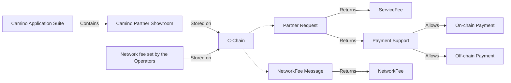
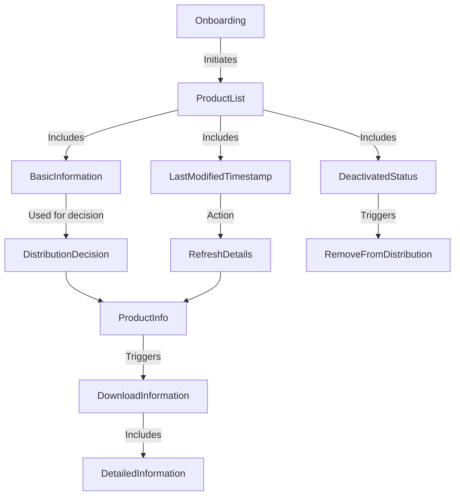
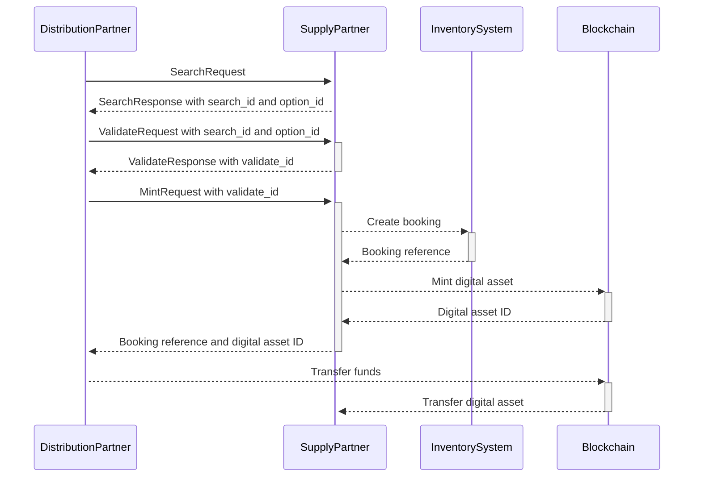
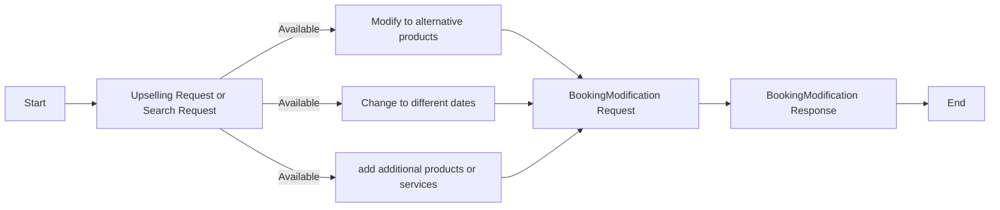

# Camino Messenger Protocol Documentation

:::info DRAFT DOCUMENTATION NOTICE

Although we released our first productive Message Types version, it is still early days and partners make substantial and frequent contributions to the Camino Message Types. Please be aware that this document is still a draft and is undergoing active development. Content, guidelines, and instructions may be subject to change.

:::

## Introduction

Welcome to the official documentation for Camino Message Types. The protocol suite is crafted to cater to a broad range of functionalities for the new world of travel and the Camino Network Partners onboarding on that journey.

An overview can be found at the [Camino Network](https://camino.network/) website and in depth information in the [whitepaper](https://camino.network/static/docs/Camino_Network_Whitepaper.pdf#view=fit).

The Camino Messenger protocol is created together with Partners from each vertical (flights, hotels, holiday homes, transfers, car rental, cruise,..). The objective is to create a message standard for the Camino Messenger, that is considered simple, efficient, complete, robust and easy to integrate by all partners. And conclusively it will delightfully be implemented and used by partners. As all other Camino Network components, the Camino Messenger Protocol is open source. Free to be used anywhere, but of course targeted to be used with the Camino Messenger.

The Camino Messenger is a client server solution to relay messages between Distribution and Supply partners. Just like WhatsApp, partners are required to install a client in their environment, which we call the messenger Bot.

Partners are required to build a connection between the Bot and their distribution or inventory system. We call that the Partner Plugin. An example implementation is provided in our github for Go and Java. SDKs are provided one our [buf.build](https://buf.build/chain4travel/camino-messenger-protocol/sdks) page, where the right libraries/plugins can be downloaded for your language and tools.

At the booking step, the Bot abstracts all the blockchain interaction. Once partners have exchanged available products, price and availability and a specific choice has been made through the messenger and secured in the inventory of the supply partner, the Supplier Bot mints a Booking Token and the Distributor Bot buys the Booking Token. For more details see the paragraphs below.

In the Partner Showroom, each partner can configure the services offered or wanted. If desired a fee for a message can be configured by suppliers to be paid for information provision or to balance the cost of processing a large number of searches.

Please do not hesitate to communicate your observations on this documentation like uncertainties, mistakes or missing explanations, so that we can continuously improve this documentation. Everybody can also participate in official Message Type reviews to help improve the message format. There is a Messenger Protocol review channel in our [Discord Server](https://discord.gg/camino). The network partners decide through voting on proposed changes.

## Messenger

In the travel industry various partners are trading travel products such as hotel nights, flight seats, transfers or tickets to an event. A travel agent might buy a package from a tour operator, a tour operator might buy a transfer from an incoming agency and a flight from a flight broker or an airline. We call the buying partner the "Distributor" and the selling partner the "Supplier".

Not all interactions between a Supplier and a Distributor require to be stored forever in a blockchain. Prices and availability of travel products are increasingly volatile and become irrelevant after the travel date has passed.

When the travel product has been booked by a distributor, we want to transact on-chain to have a single point of truth of the service booked and the price paid.

It would not make sense to only transact the booking on the blockchain and maintain the current chaos of APIs for products, prices and availabilities. There is no uniformity and the cost of maintenance of at least 100 APIs for any mid-sized player in the travel industry has a substantial cost impact.

The messenger brings one connection for all travel products, your B2B wallet is the single set of credentials you need for any connection and there is a Message Standard with sub messages that are only implemented once across every travel product, virtually creating one standard for any product. From discovery of suppliers and the products providers can offer, to the search for prices and availabilities and the booking, upselling and modification processes.

A great benefit of blockchain technology is that the payment can happen in the same transaction of the booking. No more need to have confidence in your partner that they'll pay your invoice at the end of the month. No more credit risk insurance and collection costs. No more invoicing and settlement procedures. No more disputes, payment delays and credit notes. It is as simple as passing the transaction notification from the Camino Messenger Bot to your payment platform to mark the booking as paid and find the funds in your digital wallet in stablecoin. However, if you want to split your initial steps into trading via the Camino Network as a first phase and trading in stablecoin to a second phase, that is no problem. The Digital asset representing the booking can also be traded for a zero value on-chain and a regular invoice in fiat currency can be issued by the provider.

The Camino Messenger is a decentralized network of messenger servers hosted by the validators of the Camino Network. The distribution and supply partners install a messenger client we call the Messenger Bot. A development is required to install the gRPC SDK in the programming language each partner prefers to connect their system to the Messenger Bot. Onboarding, Search and Validate messages are sent encrypted between partners. Several suppliers can be requested in the same format for one product or different travel products can be requested where a large portion of the message is the same, no matter whether a flight, rent a car, accommodation, train, transfer or activity is packaged to a multi product trip.

<figure>

<figcaption align = "center"><b>Fig.1:</b> Camino Messenger Technical Infrastructure</figcaption>
</figure>

**Performance Indicators**

In the gRPC metadata every hop and processing time is registered. There is a script to record this metadata of your requests and responses, which is gathered in a clear .csv format. This way you have full transparency of the performance of the Camino Messenger and your providers. More info on gRPC can be found [here](https://grpc.io/docs/what-is-grpc/introduction/).

## Message Type Standard

In the WhatsApp messenger, you'll find a couple of standardized Message Types you can exchange with anybody that has the WhatsApp client installed (text, location, audio, video, contact, document,..). It is the same for the Camino Messenger, all partners need to be able to uniformly use the flight, hotel, car rental, transfer, activities,.. Message Types, no matter to which partner they are connected.
The use of a Messenger client also allows to define the Message Type Standard beyond field names. There can be enhanced message validation, field data and workflow standardization.

For example, three main Message Types are:

- **Accommodation**: Defines the Message Type for Accommodations like hotels and holiday homes.
- **Transport**: Defines the Message Type for Flights, Rail and Transfer.
- **Activity**: For Tickets & Excursions.

In each of those you find a product list, product details and a search message. In **`types`** you find the sub messages that are used across all travel products, like travellers, travel period, location, geo coordinates, currencies, etc...

### Workflow

A blockchain is product or service agnostic. Conclusively our strategy is to keep the workflow for the Camino Messenger the same for any product or service as well.

Just like any API end-point from the web2 era, you can check the availability of a supplier on the Camino network with a Ping Request

#### Partners

Partner configuration can be managed via the Camino Partner Showroom, which forms part of the Camino Application Suite and is the section where partners can discover each other and initiate offline communication about the services they offer and want to obtain. Once the configuration has been set up for both partners as detailed [here](../partners/partner-config), the online communication can be started and happens as described in the following of this page.

### Fees

The following fees have to be paid to be able to exchange messages using the Camino Messenger:

1. Camino Messenger Network Fee

   The Network Fee goes towards the operators of the Messenger Server. The initial fee per message is 0.0003 CAM (which is currently 0.000045 CHF). The fee is the exact same on each server on the network and will be decided by the server operators through voting. The network fee is split between the operator (70%) and Chain4Travel (30% for further development). Instead of working with an anonymous messenger server, we encourage suppliers to host their own messenger server to earn the network fee themselves.

Each message, that means each request and each response, requires the network fee. For example, an OTA (distributor) sends a message request to 10 Accommodation Suppliers, paying 0.003 CAM (0.0003 CAM per message). If seven of them send a response back, each will pay 0.0003 CAM per message.

2. Camino Messenger Service Fee

   The Service Fee is set by the supplier for each individual service. It is specified in CAM and can have any value including 0. It's purpose is an additional income stream, balancing out traffic/processing costs, replacement for booking fees or payment for providing information services. The Service Fee is split between the Supplier (70%) and Chain4Travel (30% for further development).

The Partner and Network messages will be made available to enable automatic detection of changed partners, their settings and fees.

Figure 2: Service Fee and Network Fee

**Booking fee**
When a booking is made, ahead of the Mint message one or more validate messages have been exchanged. The Network Fee is required for each, so for one cycle of validation and booking, the Distributor pays for 2 requests and the supplier for two responses. With the 0.0003 CAM per message a total of 0.0012 CAM, 0.0006 CAM each.

The Supplier bot mints the booking token on-chain, which depends on the complexity of the operation and currently is around 0.1 CAM. The Distributor bot initiates a buy operation after the digital asset was checked if it represents the desired booking. This operation currently costs around 0.03 CAM.

<figure>

<figcaption align = "center">Fig.3: Total search and booking fees idea at a look to book of 1.000 searches to one booking</figcaption>
</figure>

In the following example we see an example of a partnership where more searches are required to create one booking. To compensate for the extra cost of processing, the supplier has set a Service Fee that is slightly higher, to compensate for internal costs. Setting such a Service does not impact partnerships with a healthy look to book ratio, but for less efficient partnerships, the incentive to optimize becomes important.

<figure>

<figcaption align = "center">Fig.4: Total search and booking fees idea at a look to book of 50.000 searches to one booking</figcaption>
</figure>

#### Onboarding

Any product or service that can be traded on the Camino Network requires an onboarding process to understand which routes and airplanes an airline or flight supplier offers, which hotels an accommodation supplier offers, and which activities an excursion supplier offers. For this onboarding and mapping process, we have designed the following messages:

1. ProductList Request: a Message Type to discover the products or services a supplier is offering with some basic information to decide to distribute the product or service or not and to map it to internal codes. It provides a LastModifiedTimestamp and a "deactivated" status.
2. ProductDetails Request: download all the information related to the product or service being offered.

Figure 5: Onboarding Workflow

#### Booking Process: Search, Validate, and Mint in Real-Time

All products and services that can be traded on the Camino Network follow a 3 step "Search-Check-Book" approach for the booking process. This is the so called pull model. There are currently many push models, where ARI (Availability, Rates and Inventory) are pushed to distribution systems for pre-packaging, fast initial search results and extended functionality like calendar views. This is not yet covered at the current state of implementation.

The stateful message flows only refers to a unique search_id and option_id from the search results to validate and then use the validate_id to create the booking. This requires partners that do only support stateless transactions to configure a temporary message storage in memory in the Camino Messenger Bot to recollect details of a previous message, required to go to the next step in the internal system.

<figure>

<figcaption align = "center">Fig.6: Stateful message flow (RQ stands for request, RS stands for response)</figcaption>
</figure>

1. Search: The first step is that a distribution partner submits a Search Request with a UUID search_id to one or more supply partners. The supply partners return a Search Response that includes a sequential option_id for each option. This represents all the possible products and options that can be bought.
2. Check: to verify whether a search option is still available at the same price after some time has passed, the Validate Request refers to the search_id and option_id to be booked. The Validate Response returns a UUID validation_id, availability status and total price.
3. Book: The Distributor submits a Mint Request that refers to the validation_id. After generating the booking in the Inventory System of the supplier and receiving a supplier reference, the messenger client creates a digital asset on the Camino blockchain and returns a digital_asset_id to the messenger client of the distributor. Which then initiates the transfer of funds to the supplier and the digital asset to the distributor in one transaction. If the transaction on chain fails or takes too long, an expiration time can be set, which triggers a roll-back of the booking in the suppliers inventory system.

Figure 7: Workflow from Search to Validate and Mint messages

#### Retrieving, Modifying, and Cancelling a Booking (pending implementation)

After an initial booking is made, a number of events can happen in its lifecycle to full delivery of the service or product:

1. **RetrieveBooking:** To check whether the blockchain, the distribution system and inventory system of a supplier have a matching booking status, the RetrieveBooking Request has been designed. For the time being it is not enough to rely on the single point of truth in the blockchain, because we want to provide an easy troubleshooting solution for suppliers to discover mismatches between their inventory system and the blockchain, but also for Partners to gain confidence in the consistency of Distribution system, Inventory system and blockchain. Conclusively we provide a switch to include the blockchain status, the provider status or both.
   There is a BookingList variant to check the status of bookings made between DateTime stamps and a BookingDetails variant to retrieve all booking details of a specific booking. This also supports automated actions in case of time-outs (ghost booking process).
2. **Upselling:** After an initial product, service or package has been sold, an optional extra or service might be added to a product or a service. This is what we refer to as "upselling" in the industry. At the Camino Network we have designed a Message Type that can be sent to each supplier that "owns" the booking for a specific product or service, so that any possible "upgrades" or additions can be offered. The AdditionalServices Request requires the distributor or supplier reference to identify the booking. In the Response any optional or alternative product or service may be offered.
3. **The BookingModification Request** allows for an already confirmed booking to be modified to alternative products or additional services or different dates, if they have previously been offered in a Search Request or Upselling Request.
4. **The CancellationRequest:** is the standard procedure to cancel a product or service. As usual it includes a CancellationCheck Request to verify if cancellation is possible and what the cancellation cost would be.

Figure 8: Upselling and Modification Workflow

There will be an extensive section of error messages so that adequate follow-up can be designed in the workflow for when something goes wrong. But also to make extensive partner performance visible and troubleshooting of under performing flows easily possible.

## The Importance of Standardization

When a Tour Operator or an Online Travel Agent has multiple providers for different products, it would be great if with one implementation of a Message Type, like for example "Accommodation", all hotel providers can be connected with the same implementation. Of course one provider might support a feature and another supplier supports another feature. For example supplier 1 supports sorting by distance to a POI, where supplier 2 supports selection of products via a polygon of geo coordinates. On the distributor side this then requires an implementation of rules for features to use or not use for the different suppliers for the same product. Another example is the implementation of the NDC standard in the airline industry. Would it not be great if with one implementation we can book flights with all connected airlines on the Camino Messenger? Or for a channel manager to distribute their hotels to all their distribution partners with just one implementation to the Camino Messenger?

### Fields

Each field has a unique numeric identifier (field number) and a specific data type, which can range from scalars like integers, floating-point numbers, booleans, and strings, as well as more complex types such as nested messages and enumerations. These fields are defined in a .proto file, which serves as a contract between communicating parties, specifying the structure of the data they exchange.

The field number serves as an identifier in the binary representation of the message, allowing for efficient encoding and decoding. In proto3 all fields are optional, and there are no built-in mechanisms for specifying required values. In proto3, the absence of a field is unset and return the default value. It will not be serialized to the wire. This means that distinguishing between an explicitly set default value and an unset field may require additional considerations in the application logic. Adding new fields in proto3 does not break backward compatibility with existing code. Unknown fields are ignored during deserialization, enabling systems to gracefully handle messages with additional fields.

The Protobuf message definition specifies fields (name/value pairs), one for each piece of data that you want to include in this type of message. Each field has a name and a type. Primitive or Scalar types are most frequently used and there is a corresponding type definition in the [proto 3 language guide](https://protobuf.dev/programming-guides/proto3/). There is also an extensive variation of field definitions known as ["Well-Known Types"](https://protobuf.dev/reference/protobuf/google.protobuf/).

### Values

The values assigned to fields are serialized into a binary format, making it efficient for data transmission and storage. The binary representation is compact, reducing both bandwidth and storage requirements compared to more verbose formats like JSON. Additionally, protobuf values are strongly typed, providing a level of data integrity and reducing the likelihood of errors during serialization and deserialization processes.

### Validations

Proto3 intentionally omits certain features to maintain simplicity and ease of use. Proto3 primarily relies on language-specific validation mechanisms rather than embedding extensive validation rules within the protobuf specification itself.

Adding additional validation logic in our application code or parsers can help ensure the integrity of the data being exchanged and can assist in catching discrepancies between different implementations/systems. We can consider validation rules for data format and constraints, also to prevent malicious or unintentional injection of incorrect or harmful data. Validations can catch errors early in the development process, which can help speed up implementation.

## Caching Static Data

In the Camino Messenger Protocol, there is no static data inclusion in any of the Search, Validate and Mint request/response messages to keep these messages as small and as efficient as possible. Static data can be pulled and kept up-to-date at the distributor side for mapping, product selection and descriptive content, but also to enrich search responses where required. Through an external schedule, suppliers can be requested for the list of new, changed and discontinued products on a daily or hourly basis, so that the details of these can be updated with the ProductDetails service in order to avoid the static data cache to lag behind. Front-ends and websites can complete the price and availability received in real-time with static data, descriptions, images, etc from this static data cache to keep the search response messages as small as possible.

Together with the use of the serialized protobuf message format, the removal of static data from the realtime messages, will result to at least 50% less traffic, which has a substantial positive impact on the performance of your applications and traffic/rendering expenses.

## Versioning and Releases

The `v1alpha` version first release was done on 18 January 2023. Feedback and reviews with Camino Network Partners lead to improvements of Message Types and the release of the first productive version "v1". A partner working with a specific Message Type to implement a connection to their system discovers errors or finds a concept is missing in the Camino MessageType. Through our Discord Messenger Protocol channel suggestions can be made and if adopted deployed with a new Message Type release. Conclusively one Message Type can be mature and and have only non-breaking improvements, while another Message Type is actively being developed. While "Accommodation" might be in a productive `v1`, we might have "Car Rental" in a `v2beta`, actively working with one or more partners to establish a productive `v2` for "Car Rental". As all message formats are released together, we simply have numeric releases that contain updates on one or more messages from one or more feature branches and PRs.

### Bot Version

_(Synced with the protocol-release)_

Every time a new version is released of any of the message types a new version of the bot is released. The latest version of the Camino Messenger Bot can be downloaded from our [Github repository](https://github.com/chain4travel/camino-messenger-bot). The main bot version is the same as the latest protocol release. Technical releases for the bot can result to a minor version increase (for example bot release 6.0.0 and 6.1.0 which both support latest protocol version 6, but bot release 6.1.0 has a technical enhancement without an update to the protocol). The bot version is included in the Matrix message header of each message.

#### Bot Version Update without an Update to a Specific Message Type

As an example, in Bot v10.0.0, we have activity service versions 1 and 2. We might release several Bot versions updating transport and accommodation services, which leads to the current Bot version being v13.0.0, while the activity service remained on versions 1 and 2 because there were no changes for this particular service.

Partners using only the activity service might consider remaining on Bot version 10.0.0 and not upgrading to versions 11.0.0 through 13.0.0. However, this scenario is unlikely, as trading partners of an example partner using only the activity service will trade with other partners who may upgrade to use the enhancements in the transport and accommodation services. Additionally, most Bot versions will likely include minor technical enhancements such as performance improvements, headers/logging, validation, etc. There could even be breaking changes like a change in encryption or the underlying messaging protocol.

### Protocol Release

A protocol release consists of the latest version of each message type. We call them _"service versions"_. The bot will always support the latest service version and the previous service version. The version before the previous version will still be in the SDK on buf.build, so that in the transition phase after the release of a new service version, it can still be used.

Example: Partners A and B can still be trading on protocol version 4 (for example using Bot release 4.0.0), while partners C and D are trading on protocol version 4 (using the same bot release 4.0.0) and partners E and F are already trading on protocol version 5 of that message type using the most recent bot release 5.0.0. Upon release of the new Bot release 6.0.0, partners trading on version 4 of the message type will receive an "obsolete" warning with each message.

### Service Versions

The version of each Message Type, referred to as _"service versions"_, is specified in the package name, with the last folder in the protobuf package name file structure indicating the version (e.g., `cmp/services/accommodation/v1`). You can check out these package names on [buf.build](https://buf.build/chain4travel/camino-messenger-protocol/docs).

To define the supported capabilities for the partner configuration, we use the entire package name to refer to a service as a capability. For example: `cmp.services.accommodation.v1.AccommodationSearchService`.

In one protocol release, each message type will be on its own service version. If many partners are actively collaborating on the Accommodation Service, this will lead to more updates for this message type then for others. We have decided to step away from semantic versioning and consider all changes in the protocol as breaking changes.

All new files will be added to a new version of the package instead of versioning each service individually and consecutively. For instance if we have a brand new file in the types and there is already v1, v2 and v3 present in the c4t branch, the newly added file will be in v4. Same goes for the services - if we already have v1 and v2, newly added files and modified files go into v3, no matter if the particular service was already present in v2,v1 or not at all. This is done to prevent circular package dependencies, which would pose no problem to protobuf but would result in an unusable SDK for instance for golang.

#### Version Transition Example

Example: Imaginary Bot version 10.0.0 holds protocol release 10, which has for the example message types Accommodation the service versions available in the SDK: accommodation service version 2, 3 and 4.

In the Partner Configuration up to 2 versions can be listed as being supported by the partner. The imaginary partner has specified to support both version 3 and 4. The Messenger Bot, reading the Partner Configuration, supports exactly those versions.

Our partner decides to upgrade to Messenger Bot Release 11.0.0, which supports Protocol release 11. In this release of the protocol a new version of the accommodation service version 5 is introduced. The SDK now supports version 3, 4 and 5 and the Partner Configuration still holds accommodation service version 3 and 4, which will allow the updated Messenger Bot to start. It also detects through a compare of the capabilities of the SDK with the partner-configuration that the current supported versions are accommodation service version 4 and 5. Conclusively each message transmitted using accommodation service version 3 will trigger a "deprecated version" warning, but still allows partners to trade.

Trading partners that were already on version 4 do not need to immediately upgrade to version 5, if the example partner supports 2 versions. Once all trading partners of our example partner have upgraded from accommodation service version 3 to version 4 or 5, our example partner can adjust the Partner Configuration to specify support for accommodation service version 4 and 5.

Schematic representation of a version upgrade for a specific message type:

<figure>

<figcaption align="center"><b>Fig.9:</b> Version transition</figcaption>
</figure>

## Why Protobuf?

Protobuf's compact binary serialization format results in smaller message sizes compared to human-readable formats like JSON, making it efficient for data transmission and storage in performance-critical applications. This is particularly beneficial in our search messages where network efficiency is a priority and where the data payload is large due to the many products and services offered in search responses. Protobuf offers a better performance than JSON in terms of serialization and deserialization speed where Protobuf's native libraries are used. Protobuf schemas are strongly typed, which leads to more robust code. Protobuf provides built-in support for evolving data structure over time while maintaining backward and forward compatibility. Protobuf is language-agnostic. Nested messages in Protobuf are a powerful feature that allow definition of a Message Type within another Message Type. This is akin to declaring a class within another class in object-oriented programming languages. There is an extensive variation of field definitions known as "Well-Known Types". There is a vast amount of documentation and examples in [protobuf documentation](https://protobuf.dev/)

In the gRPC metadata you can specify your messageID, from and to wallet addresses, so that the payload remains untouched and encrypted from P2P. You'll also find latency and processing time stamps of the different hops in the metadata, which gives you transparency and helps with troubleshooting. A performance report script is also available in the messenger bot repository.

The `cmp` directory under "camino-messenger-protocol/proto" on Github, represents the core of our protocol definitions, under which you will find Main Message Types in "services" and Nested Messages in "types".

## Main Message Types

This subset offers high-level communication utilities and interaction schemas for all products and services that can be traded on the Camino Network.
For each vertical you will find a specific search request and response. The purchase workflow is stateful, meaning that the search results are numbered with search_option_ids that can be checked using the validate request and response. Once validated, a product or service can be booked through the mint request and response with a validation_id.

For most of the products and services there will also be downloadable static data messages in the form of "descriptive info" or policies. These work always with a list functionality with a "last update date/time stamp" and a "get details" function for each item in the list.

See above details in Message Type Standard for more generic details or at the introduction of each Message Type, where we go into more detail of this specific message.

- **ping**: A simple utility Message Type, essential for health checks and service availability confirmations.
- **partners**: discovery of all partners trading on the Camino Network.
- **network_fee**: Contains specifications related to network transaction fees.
- **product_list**: List of products or services available from a supplier for every product type.
- **product_info**: Description of products or services available from a supplier for every product type.
- **accommodation**: Defines the Message Type for Accommodations like hotels and holiday homes.
- **transport**: Defines the Message Type for Flights, Rail and Transfer.
- **activity**: for Tickets & Excursions.
- **seatmap**: a message to identify the lay-out of planes, trains, venues etc. to be able to provide availability and pricing for specific seats.
- **info**: A group of messages to obtain travel information. The first message is Entry Requirements & Destination Information.
- **insurance**: A set of messages to sell insurances and claim damages in a uniform manner.
- **cruise**: Cruise (not started).
- **vehicle**: Rent a bicycle, motorbike, car or camper (not started).
- **insurance**: Insurances (not started).
- **camping**: Camping (not started).
- **package**: Packages, inherent format consisting of the above structures for the services/products included in the package (not started).

## Nested Messages - Data Types

Delving deeper into the data structures and components, protobuf uses shared structures as nested messages, which we call **"types"**. For example the traveller details in traveller.proto. The transformation to your native logic only requires a one-time development for all main Message Types that will be implemented. Nested messages provide a clear, hierarchical structure, making it easier to understand, review and discuss improvements to the Message standard with the Camino Network Partners. Other benefits of the nested structure of Protobuf are the encapsulation leading to cleaner and easier maintainable code and type safety which helps catching errors early in the integration process.

Some examples:

- **coordinate.proto**: Defines geographical coordinates.
- **currency.proto**: Handles different currency types and associated attributes.
- **date.proto**: A flexible schema for managing date-related data.
- **distance.proto**: Quantifies and categorizes distances, catering to various units and interpretations.
- **filter.proto**: Offers dynamic and static filtering capabilities.
- **geo_location.proto**: A comprehensive protocol that merges various geographical parameters.
- **traveller.proto**: Profiles, preferences, and details of travellers.
- **travel_period.proto**: Specifies the time frame for travel plans, vacations, or any related temporal span.

Whether you are integrating the Camino Message Types into your platform, extending its capabilities, or simply learning more about our approach to digital travel solutions, this documentation aims to be your comprehensive guide. We encourage developers and enthusiasts alike to explore and contribute, ensuring that the Camino Message Types remains at the forefront of innovation.

## Camino Messenger Protocol API Documentation

Camino Messenger Protocol is published on [buf.build](https://buf.build/chain4travel/camino-messenger-protocol/docs/dev). You can find below direct links to different packages in the Camino Messenger Protocol definition.

:::info NEXT STEPS

The links provided below offer access to the protocol definition for Camino Messenger.
Your review and feedback as part of our transparent development process is a fundamental part of our joint effort to create the best standard for the travel industry, created, maintained and supported by the travel industry. Your feedback is always welcome and appreciated.

So after going through the technical documentation, ask (if any) questions or provide feedback on [Discord](https://discord.gg/camino). Install and tune the [gRPC SDK](https://buf.build/chain4travel/camino-messenger-protocol/sdks/main) to map the messages for onboarding, searching, and validating offers.

:::

|          Package          |                                                         Documentation Link                                                          |                                                                Github Link                                                                |
| :-----------------------: | :---------------------------------------------------------------------------------------------------------------------------------: | :---------------------------------------------------------------------------------------------------------------------------------------: |
| Main Module Documentation |                    [Main API Documentation](https://buf.build/chain4travel/camino-messenger-protocol/docs/main)                     |                            [Main Github Repository](https://github.com/chain4travel/camino-messenger-protocol)                            |
|   Accommodation Service   | [Accommodation API Documentation](https://buf.build/chain4travel/camino-messenger-protocol/docs/main:cmp.services.accommodation.v1) | [Accommodation Github Repository](https://github.com/chain4travel/camino-messenger-protocol/tree/c4t/proto/cmp/services/accommodation/v1) |
|     Activity Service      |      [Activity API Documentation](https://buf.build/chain4travel/camino-messenger-protocol/docs/main:cmp.services.activity.v1)      |         [Activity Github Repository](https://buf.build/chain4travel/camino-messenger-protocol/docs/main:cmp.services.activity.v1)         |
|       Book Service        |          [Book API Documentation](https://buf.build/chain4travel/camino-messenger-protocol/docs/main:cmp.services.book.v1)          |             [Book Github Repository](https://buf.build/chain4travel/camino-messenger-protocol/docs/main:cmp.services.book.v1)             |
|       Info Service        |          [Info API Documentation](https://buf.build/chain4travel/camino-messenger-protocol/docs/main:cmp.services.info.v1)          |             [Info Github Repository](https://buf.build/chain4travel/camino-messenger-protocol/docs/main:cmp.services.info.v1)             |
|      Network Service      |       [Network API Documentation](https://buf.build/chain4travel/camino-messenger-protocol/docs/main:cmp.services.network.v1)       |          [Network Github Repository](https://buf.build/chain4travel/camino-messenger-protocol/docs/main:cmp.services.network.v1)          |
|      Partner Service      |       [Partner API Documentation](https://buf.build/chain4travel/camino-messenger-protocol/docs/main:cmp.services.partner.v1)       |          [Partner Github Repository](https://buf.build/chain4travel/camino-messenger-protocol/docs/main:cmp.services.partner.v1)          |
|       Ping Service        |          [Ping API Documentation](https://buf.build/chain4travel/camino-messenger-protocol/docs/main:cmp.services.ping.v1)          |             [Ping Github Repository](https://buf.build/chain4travel/camino-messenger-protocol/docs/main:cmp.services.ping.v1)             |
|      SeatMap Service      |      [SeatMap API Documentation](https://buf.build/chain4travel/camino-messenger-protocol/docs/main:cmp.services.seat_map.v1)       |         [SeatMap Github Repository](https://buf.build/chain4travel/camino-messenger-protocol/docs/main:cmp.services.seat_map.v1)          |
|     Transport Service     |     [Transport API Documentation](https://buf.build/chain4travel/camino-messenger-protocol/docs/main:cmp.services.transport.v1)     |        [Transport Github Repository](https://buf.build/chain4travel/camino-messenger-protocol/docs/main:cmp.services.transport.v1)        |
|  Nested Messages (types)  |          [Nested Messages Documentation](https://buf.build/chain4travel/camino-messenger-protocol/docs/main:cmp.types.v1)           |           [Nested Messages Github Repository](https://buf.build/chain4travel/camino-messenger-protocol/docs/main:cmp.types.v1)            |

## Branches

We have a few branches that we will use heavily in the development phase.

| Branch     | Purpose                                                                                                                                                     |
| ---------- | ----------------------------------------------------------------------------------------------------------------------------------------------------------- |
| `c4t/main` | The main branch on Github is called `c4t`. This branch will only include latest released code. Which is also tagged and pushed to buf.build's `main` branch |
| `dev`      | This branch is for on-going development, where PRs are created against. When a new release is tagged, it is merged to `c4t` branch.                         |
| `draft`    | This is used to sketch ideas and obtain feedback from partners, test the API documentation on buf.build.                                                    |
