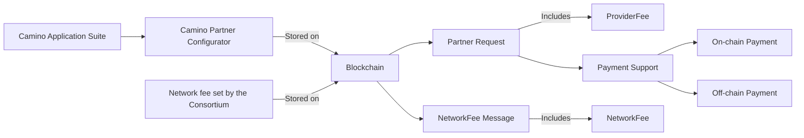
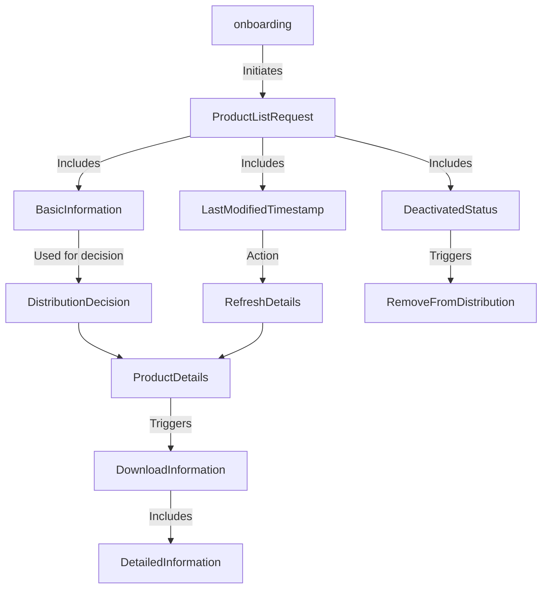
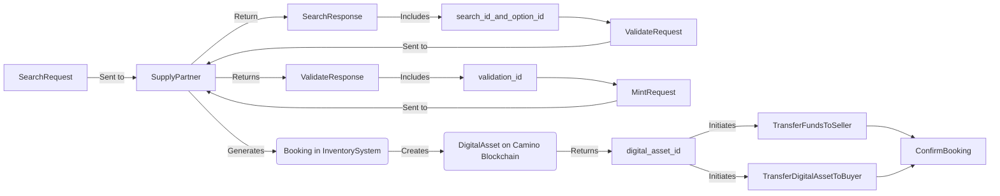

# Camino Messenger Protocol Documentation

:::info DRAFT DOCUMENTATION NOTICE

Please be aware that this document is currently a draft and is undergoing active development. Content, guidelines, and instructions may be subject to change.

:::

:::caution 🚧 ALPHA CODE NOTICE 🚧

This protocol definition is in the alpha phase of development. It is important to note that during this stage, breaking changes may occur without advance notice. Users should proceed with caution.

:::

## Introduction

Welcome to the official documentation for Camino Message Types. The protocol suite is crafted to cater to a broad range of functionalities for the new world of travel and the Camino Network Partners onboarding on that journey.

An overview can be found at the [Camino Network](https://camino.network/) website and in depth information in the [Whitepaper](https://camino.network/static/docs/Camino_Network_Whitepaper.pdf#view=fit).

The Camino Messenger protocol is created together with Partners from each vertical (flights, hotels, holiday homes, transfers, car rental, cruise,..). The objective is to create a message standard for the Camino Messenger, that is considered simple, efficient, complete, robust and easy to integrate by all partners. And conclusively it will delightfully be implemented and used by partners. As all other Camino Network components, the Camino Messenger Protocol is open source. Free to be used anywhere, but of course targeted to be used with the Camino Messenger.

// license

Please do not hesitate to communicate your observations on this documentation like uncertainties, mistakes or missing explanations, so that we can continuously improve this documentation. Every Camino Network Partner (Validator) can also participate in official Message Type reviews to help improve the message format.

## Messenger

In the travel industry various partners are trading travel products such as hotel nights, flight seats, transfers or tickets to an event. A travel agent might buy a package from a tour operator, a tour operator might buy a transfer from an incoming agency and a flight from a flight broker or an airline. We call the buying partner the "Distributor" and the selling partner the "Supplier".

Not all interactions between a Supplier and a Distributor require to be stored forever in a blockchain. Prices and availability of travel products are more and more volatile and irrelevant after the travel date has passed...

When the travel product has been booked by a distributor, we want to transact on-chain to have a single point of truth of the service booked and the price paid.

It would not make sense to only transact the booking on the blockchain and maintain the current chaos of APIs for products, prices and availabilities. There is no uniformity and the cost of maintenance of at least 100 APIs for any mid-sized player in the travel industry has a serious impact on margins.

The messenger brings one connection for all travel products, your B2B wallet is the single set of credentials you need for any connection and there is a Message Standard with sub messages that are only implemented once across every travel product, virtually creating one standard for any product. From discovery of suppliers and the products they can off to the search for prices and availabilities and the booking, upselling and modification processes.

The Camino Messenger is a decentralized network of messenger servers hosted by the validators of the Camino Network. The distribution and supply partners install a messenger client we call the Messenger Bot. A development is requited to install the gRPC SDK in the programming language each partner prefers to connect their system to the Messenger Bot. Onboarding, Search and Validate messages are sent encrypted between partners. Several suppliers can be requested in the same format for one product or different travel products can be requested where a large portion of the message is the same, no matter whether a flight, rent a car, accommodation, train, transfer or activity is packaged to a multi product trip.

<figure>

<figcaption align = "center"><b>Fig.1:</b> Camino Messenger Technical Infrastructure</figcaption>
</figure>

#### Performance indicators

in the gRPC metadata every hop and processing time is registered. There is a script to record this metadata of your requests and responses, which is gathered in a clear .csv format. This way you have full transparency of the performance of the Camino Messenger and your providers.

## Message Type Standard

In the WhatsApp messenger, you'll find a couple of standardize Message Types you can exchange with anybody that has the WhatsApp client installed (text, location, audio, video, contact, document,..). The same for the Camino Messenger, all partners need to be able to uniformly use the flight, hotel, car rental, transfer, activities,.. Message Types, no matter to which partner they are connected.
The use of a Messenger client also allows to define the Message Type Standard beyond field names. There can be enhanced message validation, field data and workflow standardization.

for example 3 main Message Types are:

- **accommodation**: Defines the Message Type for Accommodations like hotels and holiday homes.
- **transport**: Defines the Message Type for Flights, Rail and Transfer.
- **activity**: for Tickets & Excursions

In each of those you will find a product list, product details and a search message. In **types** you will find the sub messages that are used across all travel products, like travellers, travel period, location, geo coordinates, currencies, etc...

### Workflow

A blockchain is product or service agnostic. Conclusively our strategy is to keep the workflow for the Camino Messenger the same for any product or service as well.

Just like any API end-point from the web2 era, you can check the availability of a supplier on the Camino network with a Ping Request

#### Partners, partner fee and network fee

Partner configuration can be managed via the Camino Partner Configurator, which will form part of the Camino Application Suite. Two messages have been made available to enable automatic detection of changed partners, their settings and fees:

1. Partner Request gives you all active Camino Network Partners that are selling their products and services. It specifies the messages they support, the supplierFee for each message to be paid (if any) and whether the partner support on-chain payment, off-chain payment or both.
2. The Network Fee Request gives you the cost of a Message to the Camino Network for operating the Camino Messenger Servers. This fee goes towards the Partners operating a Messenger Server.

Because this information is stored on the blockchain, the changes since a certain date/time can be requested using a block-height parameter. This is required as not every node on the blockchain is updated at the exact same timestamp. Conclusively, if this information is used in the distribution system, store the block height of the last block you visited. Use the Partner Request to query the T-Chain for blocks that have a higher block height than the last block height you visited. The MessageType filters the transactions to only include those that interact with the Partner Configuration smart contracts. You filter for just the suppliers you are interested in. Process the transaction and update your application state accordingly. Finally update the last block height that you visited to the block height of the last block you processed. The same in case you store the NetworkFee externally.

Figure 2: partner fee and network fee

#### Onboarding

Any product or service that can be traded on the Camino Network requires an onboarding process to understands which routes and airplanes an airline of flight supplier offers. Or which hotels an accommodation supplier and which activities a an excursion supplier offers. For this onboarding and mapping process we have designed:

1. ProductList Request: a Message Type to discover the products or services a supplier is offering with some basic information to decide to distribute the product or service or not and to map it to internal codes. It provides a LastModifiedTimestamp and a "deactivated" status.
2. ProductDetails Request: download all the information related to the product or service being offered.

Figure 3: onboarding workflow

#### Booking process: Search, Validate and Mint in real-time

All products and services that can be traded on the Camino Network follow a 3 step "Search-Check-Book" approach for the booking process. This is the so called pull model. There are currently many push models, where ARI (Availability, Rates and Inventory) are pushed to distribution systems for pre-packaging, fast initial search results and extended functionality like calendar views. This is not yet covered at the current state of implementation.

1. Search: The first step is that a distribution partner submits a Search Request with a UUID search_id to one or more supply partners. They return a Search Response that includes a sequential option_id for each option. This represents all the possible products and options that can be bought.
2. Check: to verify whether a search option is still available at the same price after dwelling, the Validate Request refers to the search_id and option_id to be booked. The Validate Response returns a UUID validation_id, availability status and total price.
3. Book: The submits a Mint Request that refers to the validation_id. After generating the booking in the Inventory System of the supplier and receiving a supplier reference, the messenger client creates a digital asset on the Camino blockchain and returns a digital_asset_id to the messenger client of the distributor. Which then initiates the transfer of funds to the supplier and the digital asset to the distributor in one transaction.

Figure 4: search-validate-mint

#### Stateful message flow

The stateful message flows that only refers to a unique search_id and option_id from the search results to validate and then use the validate_id to create the booking, requires partners that do only support stateless transactions to configure a temporary message storage in memory to recollect details of a previous message, required to go to the next step in the internal system.

<figure>

<figcaption align = "center"><b>Fig.5:</b> Stateful message flow</figcaption>
</figure>

#### Fulfillment

After an initial booking is made, a number of events can happen in its lifecycle to full delivery of the service or product:

// discuss retrieve booking message

1. <b>RetrieveBooking:</b> To facilitate the "ghost booking process" and to check whether the distribution system and inventory system of a supplier have a matching booking status, the RetrieveBooking Request has been designed. For the time being it is not enough to rely on the single point of truth in the blockchain, because we want to provide an easy troubleshooting solution for suppliers to discover mismatches between their inventory system and the blockchain, but also for distributors to gain confidence in the consistency of systems. There is a BookingList and a BookingDetails variant.
2. <b>The CancellationRequest:</b> is the standard procedure to cancel a product or service. As usual it includes a CancellationCheck Request to verify if cancellation is possible and what the cancellation cost would be.
3. <b>Upselling:</b> After an initial product, service or package has been sold, an optional extra or service might be added to a product or a service. This is what we refer to as "upselling" in the industry. At the Camino Network we have designed a Message Type that can be sent to each supplier that "owns" the booking for a specific product or service, so that any possible "upgrades" or additions can be offered. The AdditionalServices Request requires the distributor or supplier reference to identify the booking. In the Response any optional or alternative product or service may be offered.
4. <b>The BookingModification Request</b> allows for an already confirmed booking to be modified to alternative products or additional services or different dates, if they have previously been offered in a Search Request or Upselling Request.

Finally there is an extensive section of error messages so that adequate follow-up can be designed in the workflow for when something goes wrong. But also to make extensive partner performance visible and troubleshooting of under performing flows easily possible.

## The importance of standardization

When a Tour Operator or an Online Travel Agent has multiple providers for different products, it would be great if with one implementation of a Message Type, like for example "Accommodation", all hotel providers can be connected with the same implementation. Of course one provider might support a feature and another supplier supports another feature. For example supplier 1 supports sorting by distance to a POI, where supplier 2 supports selection of products via a polygon of geo coordinates. On the distributor side this then requires an implementation of rules for features to use or not use for the different suppliers for the same product. Another example is the implementation of the NDC standard in the airline industry. Would it no be great if with one implementation we can book flights with all connected airlines on the Camino Messenger? or for a channel manager to distribute their hotels to all their distribution partners with just one implementation to the Camino Messenger?

### Fields

Each field has a unique numeric identifier (field number) and a specific data type, which can range from scalars like integers, floating-point numbers, booleans, and strings, as well as more complex types such as nested messages and enumerations. These fields are defined in a .proto file, which serves as a contract between communicating parties, specifying the structure of the data they exchange.

The field number serves as an identifier in the binary representation of the message, allowing for efficient encoding and decoding. In proto3 all fields are optional, and there are no built-in mechanisms for specifying required values. In proto3, the absence of a field is unset and return the default value. It will not be serialized to the wire. This means that distinguishing between an explicitly set default value and an unset field may require additional considerations in the application logic. Adding new fields in proto3 does not break backward compatibility with existing code. Unknown fields are ignored during deserialization, enabling systems to gracefully handle messages with additional fields.

The Protobuf message definition specifies fields (name/value pairs), one for each piece of data that you want to include in this type of message. Each field has a name and a type. Primitive or Scalar types are most frequently used and there is a corresponding type definition in the [proto 3 language guide](https://protobuf.dev/programming-guides/proto3/). There is also an extensive variation of field definitions known as ["Well-Known Types"](https://protobuf.dev/reference/protobuf/google.protobuf/).

### Values

The values assigned to fields are serialized into a binary format, making it efficient for data transmission and storage. The binary representation is compact, reducing both bandwidth and storage requirements compared to more verbose formats like JSON. Additionally, protobuf values are strongly typed, providing a level of data integrity and reducing the likelihood of errors during serialization and deserialization processes.

### Validations

Proto3 intentionally omits certain features to maintain simplicity and ease of use. Proto3 primarily relies on language-specific validation mechanisms rather than embedding extensive validation rules within the protobuf specification itself.

Adding additional validation logic in our application code or parsers can help ensure the integrity of the data being exchanged and can assist in catching discrepancies between different implementations/systems. We can consider validation rules for data format and constraints, also to prevent malicious or unintentional injection of incorrect or harmful data. Validations can catch errors early in the development process, which can help speed up implementation.

## Caching static data

In the Camino Messenger Protocol, there is no static data inclusion in any of the Search, Validate and Mint request/response messages to keep these messages as small and as efficient as possible. Static data can be pulled and kept up-to-date at the distributor side for mapping, product selection and descriptive content, but also to enrich search responses where required. Through an external schedule, suppliers can be requested for the list of new, changed and discontinued products on a daily or hourly basis, so that the details of these can be updated with the ProductDetails service in order to avoid the static data cache to lag behind. Front-ends and websites can complete the price and availability received in real-time with static data, descriptions, images, etc from this static data cache to keep the search response messages as small as possible.

## Versioning and releases

We are currently in the V1Alpha version and the first release was done on 18 January 2023. Feedback and reviews will lead improvements of a Message Type, as suggested by our partners. A partner working with a specific Message Type to implement a connection to their system discovers errors or finds a concept is missing in the Camino MessageType. Conclusively one Message Type can be mature and suffer few changes, while another Message Type is actively being developed. While "Accommodation" might be in a productive V1, we might have "Car Rental" in a V2Beta. As all message formats are released together, we simply have numeric releases that contain updates on one or more messages from one or more feature branches and PRs. Unless a partner is working together with us to develop a new message or new features in an existing message, the c4t (main) branch should be used.

## Why Protobuf

Protobuf's compact binary serialization format results in smaller message sizes compared to human-readable formats like JSON, making it efficient for data transmission and storage in performance-critical applications. This is particularly beneficial in our search messages where network efficiency is a priority and where the data payload is large due to the many products and services offered in search responses. Protobuf offers a better performance than JSON in terms of serialization and deserialization speed where Protobuf's native libraries are used. Protobuf schemas are strongly typed, which leads to more robust code. Protobuf provides built-in support for evolving data structure over time while maintaining backward and forward compatibility. Protobuf is language-agnostic. Nested messages in Protobuf are a powerful feature that allow definition of a Message Type within another Message Type. This is akin to declaring a class within another class in object-oriented programming languages. There is an extensive variation of field definitions known as "Well-Known Types". There is a vast amount of documentation and examples in [protobuf documentation](https://protobuf.dev/)

In the gRPC metadata you can specify your messageID, from and to wallet addresses, so that the payload remains untouched and encrypted from P2P. You'll also find latency and processing time stamps of the different hops in the metadata, which gives you transparency and helps with troubleshooting. A performance report script is also available in the messenger bot repository.

The `cmp` directory under "camino-messenger-protocol/proto" on Github, represents the core of our protocol definitions, under which you will find Main Message Types in "services" and Nested Messages in "types".

## Main Message Types

This subset offers high-level communication utilities and interaction schemas for all products and services that can be traded on the Camino Network.
For each vertical you will find a specific search request and response. The purchase workflow is stateful, meaning that the search results are numbered with search_option_ids that can be checked using the validate request and response. Once validated, a product or service can be booked through the mint request and response with a validation_id.

For most of the products and services there will also be downloadable static data messages in the form of "descriptive info" or policies. These work always with a list functionality with a "last update date/time stamp" and a "get details" function for each item in the list.

See above details in Message Type Standard for more generic details or at the introduction of each Message Type, where we go into more detail of this specific message.

- **ping**: A simple utility Message Type, essential for health checks and service availability confirmations.
- **partners**: discovery of all partners trading on the Camino Network
- **network_fee**: Contains specifications related to network transaction fees.
- **product_list**: List of products or services available from a supplier
- **product_details**: Description of products or services available from a supplier
- **accommodation**: Defines the Message Type for Accommodations like hotels and holiday homes.
- **transport**: Defines the Message Type for Flights, Rail and Transfer.
- **activity**: for Tickets & Excursions
- **cruise**: Cruise (not started)
- **car_rental**: Rent a car, Rent a Camper
- **insurance**: Insurances (not started)
- **camping**: Camping (not started)
- **package**: Packages, inherent format consisting of the above structures for the services/products included in the package
- **flight_status**: Flight status information
- **entry_destination**: Entry requirements & Destination information

## Nested Messages - Data Types

Delving deeper into the data structures and components, protobuf uses shared structures as nested messages, which we call **"types"**. For example the traveller details in traveller.proto. The transformation to your native logic only requires a one-time development for all main Message Types that will be implemented. Nested messages provide a clear, hierarchical structure, making it easier to understand, review and discuss improvements to the Message standard with the Camino Network Partners. Other benefits of the nested structure of Protobuf are the encapsulation leading to cleaner and easier maintainable code and type safety which helps catching errors early in the integration process.

Some examples:

- **coordinate.proto**: Captures geographical coordinates.
- **currency.proto**: Handles different currency types and associated attributes.
- **date.proto**: A flexible schema for managing date-related data.
- **distance.proto**: Quantifies and categorizes distances, catering to various units and interpretations.
- **filter.proto**: Offers dynamic and static filtering capabilities.
- **geo_location.proto**: A comprehensive protocol that merges various geographical parameters.
- **traveller.proto**: Profiles, preferences, and details of travellers.
- **travel_period.proto**: Specifies the time frame for travel plans, vacations, or any related temporal span.

Whether you are integrating the Camino Message Types into your platform, extending its capabilities, or simply learning more about our approach to digital travel solutions, this documentation aims to be your comprehensive guide. We encourage developers and enthusiasts alike to explore and contribute, ensuring that the Camino Message Types remains at the forefront of innovation.

## Camino Messenger Protocol API Documentation

Camino Messenger Protocol is published on [buf.build](https://buf.build/chain4travel/camino-messenger-protocol/docs/dev). You can find below direct links to different packages in the Camino Messenger Protocol definition.

:::info EARLY DRAFT OF PROTOCOL DEFINITION

The links provided below offer access to the preliminary draft of the protocol definition for Camino Messenger.
This early version is made available for review and feedback as part of our transparent development process.

:::

|          Package          |                                                            Documentation Link                                                            |                                                                  Github Link                                                                   |
| :-----------------------: | :--------------------------------------------------------------------------------------------------------------------------------------: | :--------------------------------------------------------------------------------------------------------------------------------------------: |
| Main Module Documentation |                       [Main API Documentation](https://buf.build/chain4travel/camino-messenger-protocol/docs/main)                       |                              [Main Github Repository](https://github.com/chain4travel/camino-messenger-protocol)                               |
|   Accommodation Service   | [Accommodation API Documentation](https://buf.build/chain4travel/camino-messenger-protocol/docs/main:cmp.services.accommodation.v1alpha) | [Accommodation Github Repository](https://github.com/chain4travel/camino-messenger-protocol/tree/c4t/proto/cmp/services/accommodation/v1alpha) |
|     Activity Service      |      [Activity API Documentation](https://buf.build/chain4travel/camino-messenger-protocol/docs/main:cmp.services.activity.v1alpha)      |         [Activity Github Repository](https://buf.build/chain4travel/camino-messenger-protocol/docs/main:cmp.services.activity.v1alpha)         |
|      Network Service      |       [Network API Documentation](https://buf.build/chain4travel/camino-messenger-protocol/docs/main:cmp.services.network.v1alpha)       |          [Network Github Repository](https://buf.build/chain4travel/camino-messenger-protocol/docs/main:cmp.services.network.v1alpha)          |
|      Partner Service      |       [Partner API Documentation](https://buf.build/chain4travel/camino-messenger-protocol/docs/main:cmp.services.partner.v1alpha)       |          [Partner Github Repository](https://buf.build/chain4travel/camino-messenger-protocol/docs/main:cmp.services.partner.v1alpha)          |
|       Ping Service        |          [Ping API Documentation](https://buf.build/chain4travel/camino-messenger-protocol/docs/main:cmp.services.ping.v1alpha)          |             [Ping Github Repository](https://buf.build/chain4travel/camino-messenger-protocol/docs/main:cmp.services.ping.v1alpha)             |
|     Transport Service     |     [Transport API Documentation](https://buf.build/chain4travel/camino-messenger-protocol/docs/main:cmp.services.transport.v1alpha)     |        [Transport Github Repository](https://buf.build/chain4travel/camino-messenger-protocol/docs/main:cmp.services.transport.v1alpha)        |
|  Nested Messages (types)  |          [Nested Messages Documentation](https://buf.build/chain4travel/camino-messenger-protocol/docs/main:cmp.types.v1alpha)           |           [Nested Messages Github Repository](https://buf.build/chain4travel/camino-messenger-protocol/docs/main:cmp.types.v1alpha)            |

## Branches

We have a few branches that we will use heavily in the development phase.

| Branch     | Purpose                                                                                                                                                 |
| ---------- | ------------------------------------------------------------------------------------------------------------------------------------------------------- |
| `c4t/main` | The main branch on Github is called c4t. This branch will only include latest released code. Which is also tagged and pushed to buf.build's main branch |
| `dev`      | This branch is for on-going development, where PRs are created against. When a new release is tagged, it is merged to `c4t` branch.                     |
| `draft`    | This is used to sketch ideas and obtain feedback from partners, test the API documentation on buf.build.                                                |
