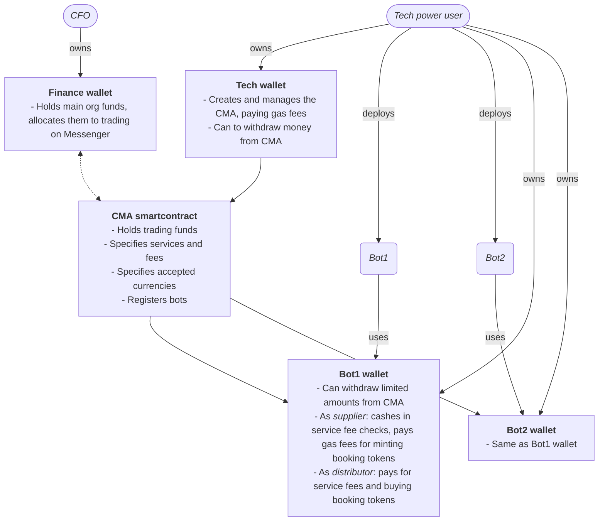

# Camino Partner Configuration

:::info DRAFT DOCUMENTATION NOTICE

Although we released our first production-ready version of Camino Messenger, it is still early days and we plan to add and refine functionality as long as partners begin to send and receive substantial transaction traffic. Camino Partner Configuration is thus under active development and we suggest you check back regularly for updates, as content, guidelines, and instructions may be subject to change.

:::

## Introduction

The Partner Configuration allows Partners to make themselves known to the Camino Network as service providers, or as looking for services from other Partners in the Network. Upon matching between services wanted and offered by two parties, such services will be then traded on Camino Messenger.

Services are defined within the concept of Message Types: you can find [here](../camino-messenger/introduction#main-message-types) a complete documentation with pointers to the list of available types. As a distributor or a supplier, a Partner usually wants _and_ offers several services at the same time.
For example:

A hospitality distributor, e.g. a tour operator, might want to consume:

- AccommodationProductInfoService
- AccommodationProductListService
- AccommodationSearchService
- ValidationService
- MintService

A hospitality supplier, e.g. a hotel chain, might offer the same services for consumption.

A the same time, the tour operator might want to consume from an info provider:

- DestinationInformationService [TODO]

Which also requires that the consumer exposes a callback method to actually receive events:

- CallBackService [TODO]

And the information supplier has then to conversely offer / consume the respective services. It can become a bit intricated for partners wanting and offering multiple services: the Camino Foundation and the community are available to support with best practices for your specific case and addressing implementation on our [Discord](https://discord.gg/camino).

## Actors and components

Before dwelwing into the details of how to configure a Partner, it is useful to go through an explanation of involved actors (human and software components, onchain and offchain) and their specific responsibilities in the Partner's operation on Camino Messenger.

 The two key roles at a Partner's involved are the Chief Financial Officer (CFO) and a Tech Power User. The CFO is responsible for the Finance Wallet, usually multi-sig, which holds the organization’s main funds. These funds are allocated for trading activities on the Messenger but the CFO never is involved in its operation.

The Tech power user, on the other hand, is the responsible for the Tech Wallet, which receives funds from the CFO and utilizes them for Messenger operations. By logging in with the Tech Wallet, she is able to create and manage the Partner Configuration, pay for the gas fees involved with setting up and trading on the Camino Messenger, and widhtaw funds, wether to her wallet or to the Finance Wallet.

The Camino Messenger Account, or CMA, is a smartcontract (actually an ensemble of smartcontracts), acting as the financial backbone of the Partner Configuration, holding the funds designated for trading on behalf of the Partner on the Camino Messenger. It also stores all configuration settings such as the services offered and wanted (and their versions), the applicable service fees and the accepted currencies. It also maintains a list of the wallets of the offchain bots with which the Partner's systems interact with the Messenger.

The Tech power user (or the Partner's tech departnment) is responsible for the deployments of bots (for an in-depth explanation on bots and how to configure them please refer to [here](../camino-messenger/bot/configuration)). Bots are offchain components that are idenfified and operate on chain through respective wallets, thus having controlled access to the funds in the CMA, with limits on the amounts they can withdraw. The bot wallets facilitate bots' specific blockchain operations. In the case of a supplier's bot, the bot wallet cashes in service fee checks and covers the gas fees for minting booking tokens upon booking confirmation by the partner's systems. In the case of a distributor's bot, the bot wallet handles payments for service fees and the purchase of such booking tokens.

This flow ensures that the offchain bots can operate within the constraints of the smartcontract, while enabling efficient management of funds and services onchain.

## Step-by-Step Configuration Guide

This playbook is designed to guide Tech power users through the configuration process for their Camino Messenger Accounts.

1. Register as Partner in the Parter Showroom, or Claim your Partner if it is already listed, as described [here](../partners/introduction).

2. Make sure that your Tech wallet linked to your Partner details:

   - Is KYC/KYB verified.
   - Holds at least 110 CAM on C-Chain. Of these, 100 will be necessary to be bonded into the Messenger Account to be then used to pay for service fees, and the rest will be plenty to pay for the gas associated to all subsequent configuration settings and to pre-fund bot wallets.

3. Gather all necessary information:

   - Services wanted on Camino Messenger, as explained above
   - Services that you are offering via your bot(s), or that you plan to offer, as explained above
   - Currencies that you want to accept payments in

4. Log in to the Camino Suite with your Tech wallet linked to your Partner details.

5. Browse to the Partners section, then to My Partner details, then click on "Create Messenger Account".

6. Set the Prefund Amount (to minimum 100 CAM, in the following example screenshot 105 per the considerations above) and Create your Messenger Account:

<figure>

<figcaption align="center">Fig.1: Camino Messenger Account creation</figcaption>
</figure>

7. You are now in the configuration phase proper. Configure the Accepted currencies in My Messenger Account tab. You can find a detailed explanation on how this tab works below.

8. Configure the Offered Services in their own tab. You can find a detailed explanation on how this tab works below.

9. Configure the Wanted Services in their own tab. You can find a detailed explanation on how this tab works below. After this step, you are ready to search for matching partners in the Partner Showroom, and you can contact and be contacted to discuss communication via Camino Messenger.

10. Install your bot(s) as described [here](../camino-messenger/bot/installation), or gather each installed bot's wallet address if they have been installed already.

11. Add each bot into the Manage Bots tab. You can find a detailed explanation on how this tab works below.

12. Fund each bot by transfering a little sum (1 CAM for example) from your Tech wallet's C-Chain address to their addresses.

## Partner Configuration in detail

### My Messenger Account tab

<figure>

<figcaption align="center">Fig.2: Camino Messenger Account details management</figcaption>
</figure>

The "My Messenger Account" screen is where you can see an overview of your Camino Messenger address, services, and you can manage accepted currencies and their balances. Below is a breakdown of the functions available on this tab:

1. **Detailed info**:

   - **Camino Messenger Address**: This address (e.g., `0x97AD255Def722D1aeB06...136326E553e6`) is used to receive topups of supported currencies. Use the "Copy" button to copy the address to your clipboard for use in external wallets or other platforms.
   - **Offered Services**: The list of services you are providing is displayed here (e.g., "AccommodationSearch").
   - **Wanted Services**: This shows services you are seeking from other partners (e.g., "CountryEntryRequirements").
   - **Configured Bots**: This indicates how many bot wallets are currently linked to your account (e.g., "You have 1 configured bot").

2. **Accepted Currencies**:

   - Manage the currencies you accept by selecting from the list below.

     - **CAM**: Displays the current balance (e.g., "105.0 CAM"). The "Withdraw" button allows you to transfer funds to another wallet by initiating a withdrawal form. In such form, you are able to: - Indicate the destination C-Chain address, and you have a button to easily set it to the logged in Tech power user. - Indicate the amount to withdraw, and you have a button to easily set it to the maximum available for withdrawal. - Instruct the transfer out.
       To topup the CAM balance, you'd need to transfer from any C-Chain wallet to the Camino Messenger displayed above.
       Note: ERC20 token support is coming soon. Please refrain for the time being from transfering in any non-CAM funds.
     - **USDC, EURC, EURe, EURSH** (coming soon): These are potential future currencies you can enable. The "Withdraw" option is currently disabled for these.
     - **Fiat (off-chain)**: This option can be selected to enable support for fiat-based transactions, which occur outside the blockchain.

   - **Configure Currencies Button**: Click this button to enable the checkboxes, then "Save Changes" when you are done with editing the allowed currencies list.

### Offered Services tab

<figure>

<figcaption align="center">Fig.3: Camino Messenger Account offered services</figcaption>
</figure>

The "Offered Services" screen allows partners to configure and manage the services they offer on the Camino Messenger. Here's a detailed breakdown of the functions that can be enabled on this tab by clicking on "Configure Services":

1. **Add / Remove a Service**:

   - A dropdown menu labeled "Select a service" allows you to choose from available services and versions, e.g. "cmp.services.accommodation.v2.AccommodationSearchService". When adding a service, you can also configure it as below.
   - For a listed service, a "Remove Service" button allows you to remove it.

2. **Configure a Service**:
   - **Fee**: You can set a fee to be paid by the caller of this service, displayed in CAM, e.g. 0.05 CAM.
   - **Rack Rates**: A checkbox to indicate whether you're offering "rack" rates (public, non-negotiated rates) for this service.
   - **Capabilities**: A text field to describe the specific capabilities of your service, e.g. "3\* hotels in the Caribbean". An "Add Capability" button allows to add a new capability, while emptying a capability will delete it.
     Note: Setting a Fee and Rack Rates make sense for Search services mostly.

Upon modification, click on "Save Changes" to persist your work on this tab.

### Wanted Services tab

<figure>

<figcaption align="center">Fig.4: Camino Messenger Account wanted services</figcaption>
</figure>

The "Wanted Services" screen allows partners to configure and manage the services they ar looking for on the Camino Messenger. Here's a detailed breakdown of the functions that can be enabled on this tab by clicking on "Configure Services":

1. **Add / Remove a Service**:
   - A dropdown menu labeled "Select a service" allows you to choose from available services and versions, e.g. "cmp.services.accommodation.v2.CountryEntryRequirementsService".
   - For a listed service, a "Remove Service" button allows you to remove it.

Upon modification, click on "Save Changes" to persist your work on this tab.

### Manage Bots tab

<figure>

<figcaption align="center">Fig.5: Camino Messenger Account bot wallet management</figcaption>
</figure>

The "Manage Bots" screen allows partners to manage the bot wallets linked to this Camino Messenger Account. Here's a detailed breakdown of the functions that can be enabled on this tab:

The "Manage Bots" screen allows partners to manage the bot addresses associated with their Messenger Account on the Camino Network. Here's a detailed breakdown of the functions available on this tab:

1. **Bot List**:

   - Displays the addresses of all bot wallets currently using this Messenger Account, e.g., "0xB21385af6bFD19d0E787d718FB83559e515412eB".
   - For each bot, the balance in CAM currently available in the wallet for the bot to operate is displayed (COMING SOON).

   to operate the bot is

   - A "Remove" button to delete the bot from the list

2. **Add / Remove a Bot**:
   - Enter a new bot wallet address in the "Bot" field, then click the "Add" button.
   - Click on the "Remove" button to remove a bot.

Note: upon adding a bot, a little amount needs to be tranfered to its wallet address to render this operational, and the amount needs to be reloaded so that it's never 0. A auto topup mechanism is being developed (COMING SOON).
